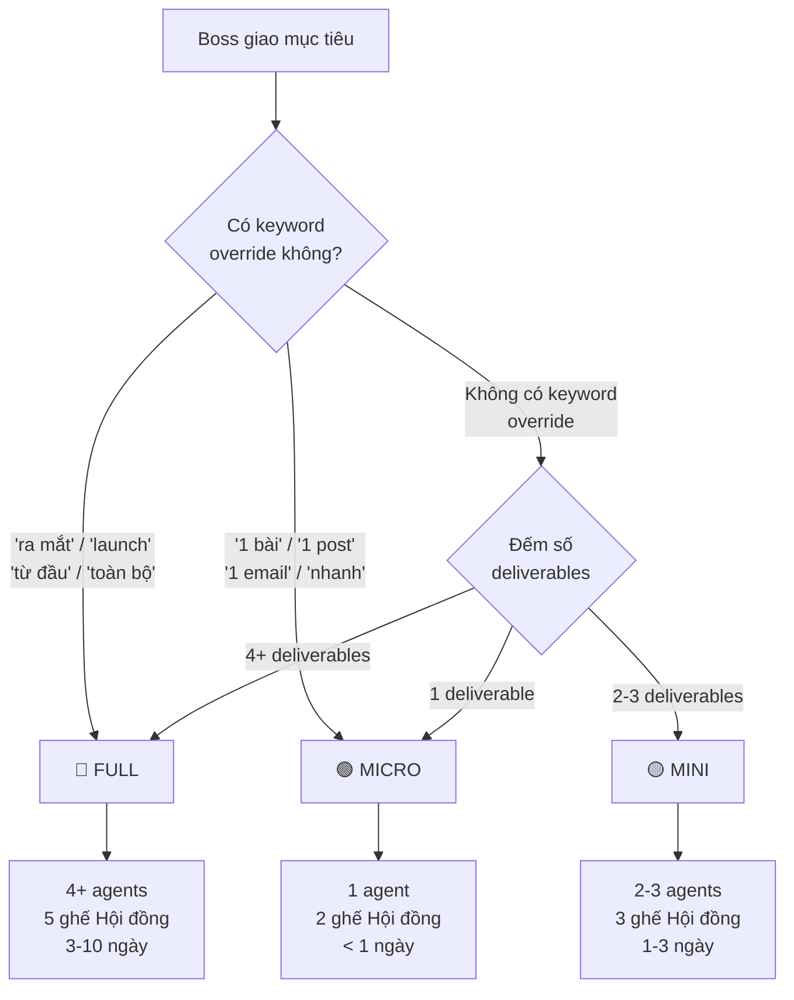

# 📏 Scope Classifier — Phân loại dự án

> CEO Orchestrator đọc file này tại **Bước 3** để phân loại scope dự án trước khi lập kế hoạch.
> Scope quyết định: số agent được triệu tập, mức độ review của Hội đồng, và timeline dự kiến.

---

## Flowchart phân loại Scope



---

## Quy trình phân loại (Text version)

```
Boss request → Kiểm tra keyword override:

  CÓ keyword override:
    "ra mắt" / "launch" / "từ đầu" / "toàn bộ hệ thống" → FULL (luôn luôn)
    "chiến dịch" / "campaign"                              → MINI hoặc FULL (xem thêm context)
    "1 bài" / "1 post" / "1 email" / "nhanh"              → MICRO (luôn luôn)

  KHÔNG có keyword override → Đếm deliverables:
    1 deliverable                                          → MICRO
    2-3 deliverables                                       → MINI
    4+ deliverables HOẶC "complete plan"                   → FULL

  KHI NGHI NGỜ → Chọn scope LỚN hơn (an toàn hơn)
```

---

## Bảng so sánh chi tiết: Micro / Mini / Full

| Tiêu chí | 🟢 MICRO | 🟡 MINI | 🔴 FULL |
|----------|---------|--------|--------|
| **Số deliverables** | 1 | 2-3 | 4+ |
| **Số agents** | 1 | 2-3 | 4-12+ |
| **Timeline** | < 1 ngày (vài giờ) | 1-3 ngày | 3-10 ngày |
| **Ghế Hội đồng** | 2 ghế (Strategy + Finance) | 3 ghế (Strategy + Finance + Marketing) | 5 ghế đầy đủ |
| **Mức rủi ro** | Thấp | Trung bình | Cao |
| **Budget thường** | 0đ – 500K | 500K – 5M | 5M+ |
| **Ví dụ** | Viết 1 bài post, 1 email | Viết ads + landing page | Ra mắt sản phẩm hoàn chỉnh |
| **Cần Boss duyệt?** | Không (CEO tự quyết sau Hội đồng) | Tùy (nếu budget > 2M → cần Boss) | Có (luôn trình Boss trước thực thi) |
| **Memory query** | 1 project tương tự | 2 projects tương tự | 3+ projects + full lessons |

---

## Keyword Override — Bảng tra nhanh

| Boss nói | Scope | Lý do |
|----------|-------|-------|
| "ra mắt khóa học mới" | FULL | Keyword "ra mắt" → luôn Full |
| "launch sản phẩm" | FULL | Keyword "launch" → luôn Full |
| "xây từ đầu" | FULL | Keyword "từ đầu" → cần toàn bộ pipeline |
| "toàn bộ hệ thống bán hàng" | FULL | Keyword "toàn bộ" → Full |
| "chạy chiến dịch quảng cáo" | MINI/FULL | "Chiến dịch" → xem context: nếu đã có assets → Mini; nếu chưa có gì → Full |
| "viết 1 bài content" | MICRO | Keyword "1 bài" → luôn Micro |
| "1 email nhanh" | MICRO | Keyword "1" + "nhanh" → Micro |
| "tạo landing page" | MINI | 2 deliverables (copy + HTML) → Mini |
| "vớt khách nguội" | MICRO | 1 deliverable (email re-engage) → Micro |
| "viết ads + email + landing" | MINI/FULL | 3 deliverables → Mini; nếu kèm "cho sản phẩm mới" → Full |
| "phân tích + scale chiến dịch" | FULL | Cần data + analytics + re-run → Full |

---

## Ví dụ thực tế cho từng Scope

### 🟢 MICRO — Ví dụ

**Ví dụ 1:** Boss nói: "Viết 1 bài post Facebook về lợi ích của AI cho doanh nghiệp nhỏ"
- Deliverables: 1 bài post
- Agent: hvco-creator
- Scope: **MICRO**
- Hội đồng: 2 ghế (Strategy + Finance) — review nhanh

**Ví dụ 2:** Boss nói: "Viết email follow-up cho mấy người đăng ký webinar nhưng không tham dự"
- Deliverables: 1 chuỗi email re-engage
- Agent: follow-up-engine
- Scope: **MICRO**

**Ví dụ 3:** Boss nói: "Tạo 1 image prompt cho ảnh bìa khóa học"
- Deliverables: 1 prompt
- Agent: agent-image-prompt
- Scope: **MICRO**

### 🟡 MINI — Ví dụ

**Ví dụ 1:** Boss nói: "Viết bộ quảng cáo Facebook + landing page cho khóa học AI Basics"
- Deliverables: ad copies + landing page (2 deliverables)
- Agents: ad-copy-machine → agent-08b-landingpage
- Scope: **MINI**
- Hội đồng: 3 ghế (Strategy + Finance + Marketing)

**Ví dụ 2:** Boss nói: "Nghiên cứu avatar cho ngách coaching + tìm unique mechanism"
- Deliverables: avatar.md + hero-mechanism.md (2 deliverables)
- Agents: avatar-builder → hero-mechanism
- Scope: **MINI**

**Ví dụ 3:** Boss nói: "Đóng gói offer cho dịch vụ tư vấn 1-1"
- Deliverables: money-model.md + offer.md (2 deliverables)
- Agents: money-model → offer-architect
- Scope: **MINI**

**Ví dụ 4:** Boss nói: "Tạo chuỗi email nurture cho khách đăng ký ebook"
- Deliverables: avatar.md (nếu chưa có) + email-sequences.md (2 deliverables)
- Agents: avatar-builder → email-closer
- Scope: **MINI**

### 🔴 FULL — Ví dụ

**Ví dụ 1:** Boss nói: "Ra mắt khóa học AI Marketing tháng 8, target 300 học viên"
- Deliverables: avatar, mechanism, money model, offer, HVCO, funnel, ads, landing, VSL, emails, follow-up, call script (12 deliverables)
- Agents: toàn bộ pipeline 12 agents
- Scope: **FULL**
- Hội đồng: 5 ghế đầy đủ — review kỹ

**Ví dụ 2:** Boss nói: "Xây toàn bộ hệ thống bán hàng cho dịch vụ agency"
- Deliverables: 8+ files marketing
- Scope: **FULL**

**Ví dụ 3:** Boss nói: "Chiến dịch đang chạy tốt, muốn scale lên gấp 3 — phân tích rồi mở rộng"
- Deliverables: analytics report + action plan + re-run agents
- Scope: **FULL** (vì cần data → analytics → quyết định → thực thi)

---

## Mapping Scope → Ghế Hội đồng Cố vấn

Mỗi scope triệu tập số ghế Hội đồng khác nhau:

### 🟢 MICRO → 2 ghế

| Ghế | Vai trò | Chấm gì |
|-----|---------|---------|
| **Strategy** | Chiến lược gia | Mục tiêu có hợp lý? Có align với business direction? |
| **Finance** | Tài chính | Chi phí có xứng đáng? ROI dự kiến? |

### 🟡 MINI → 3 ghế

| Ghế | Vai trò | Chấm gì |
|-----|---------|---------|
| **Strategy** | Chiến lược gia | Chiến lược tổng thể + timing |
| **Finance** | Tài chính | Budget, ROI, unit economics |
| **Marketing** | Marketing | Messaging, positioning, kênh phân phối |

### 🔴 FULL → 5 ghế

| Ghế | Vai trò | Chấm gì |
|-----|---------|---------|
| **Strategy** | Chiến lược gia | Vision, competitive advantage, market timing |
| **Finance** | Tài chính | Full P&L dự kiến, CAC/LTV, break-even |
| **Marketing** | Marketing | Funnel logic, copy direction, channel strategy |
| **Operations** | Vận hành | Timeline khả thi? Resources đủ? Bottleneck? |
| **Customer** | Đại diện khách hàng | Offer có hấp dẫn từ góc nhìn khách? Pain point đúng chưa? |

---

## Quy tắc vàng

> **Khi nghi ngờ giữa 2 scope → LUÔN chọn scope LỚN hơn.**
>
> Lý do: Scope lớn hơn = review kỹ hơn = ít sai sót hơn = tiết kiệm thời gian sửa sau.
> Một dự án Mini bị đánh giá Full sẽ chỉ tốn thêm thời gian review.
> Một dự án Full bị đánh giá Mini có thể dẫn đến thiếu sót nghiêm trọng.

---

## Edge Cases & Xử lý đặc biệt

| Tình huống | Xử lý |
|-----------|-------|
| Boss giao mục tiêu mơ hồ ("tôi muốn bán nhiều hơn") | Hỏi lại để clarify trước khi phân loại scope |
| Boss yêu cầu "nhanh" nhưng scope thực tế là Full | Trình bày: "Mục tiêu này cần scope Full (X deliverables). Nếu Boss muốn nhanh, có thể chia thành 2-3 Mini projects." |
| Boss đã có sẵn nhiều assets (avatar, offer...) | Giảm agents trong chuỗi (skip agents đã có output), nhưng scope vẫn tính theo deliverables CẦN TẠO MỚI |
| Dự án Rescue (sửa chiến dịch đang chạy) | Scope tính theo số deliverables cần SỬA, không phải tổng số deliverables ban đầu |
| Boss muốn A/B test (2 version) | Tăng scope lên 1 bậc (vì gấp đôi deliverables) |
