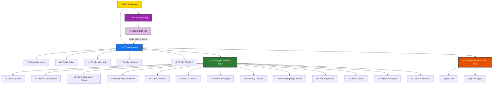

# 🏢 AI Agent For Business (AAFB) — Sơ đồ Tổ chức Doanh nghiệp AI

Chào mừng đến với hệ thống điều hành doanh nghiệp tự động **AI Agent For Business (AAFB)** được cấu hình trên nền tảng Paperclip. Hệ thống này bao gồm các lớp Cố vấn, lớp Điều hành, lớp Thực thi chuyên môn (ASSP) và lớp Kiểm soát Số liệu.

## 📊 Sơ đồ Báo cáo (Org Chart)

## ⚙️ Hướng dẫn Vận hành Chung
1. **CEO Orchestrator** nhận nhiệm vụ trực tiếp từ Boss, xây dựng bản kế hoạch ban đầu, phân loại phạm vi (Micro/Mini/Full) và trình lên **Hội đồng Cố vấn**.
2. **Hội đồng Cố vấn** dưới sự chủ trì của **Chủ Tịch** sẽ tiến hành đánh giá kế hoạch theo các tiêu chí chuyên môn và chấm điểm (Rubric 100 điểm). Kế hoạch chỉ được triển khai khi đạt điểm số tối thiểu **80/100**.
3. Sau khi được duyệt, CEO kích hoạt các **Agent ASSP** tương ứng với kịch bản vận hành để sản xuất ra các tài nguyên kinh doanh.
4. Khi chiến dịch hoàn thành, **Agent Data** thu thập số liệu thực tế, chuyển giao cho **Agent Analytics** phân tích hiệu suất và trả kết quả tối ưu hóa (Scale/Rescue/Hold) về cho CEO ghi nhận vào bộ nhớ Project Journal.
